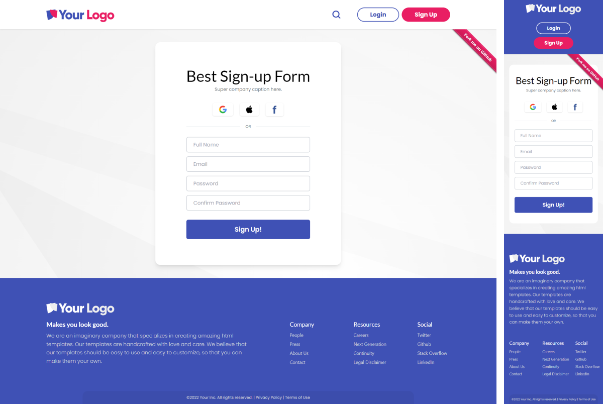

# Tailwind Login & Sign Up Template

A responsive "Login" and "Sign up" UI template with header & footer components included.

> Made with [Tailwind CSS](https://tailwindcss.com/), [Vite](https://vitejs.dev/) + [Preact](https://preactjs.com/), and Typescript.

An open source web template is the perfect way to get started with your own website. Hope you like it.

## Demo

Live Demo: [https://rudral.github.io/tailwind-template/](https://rudral.github.io/tailwind-template/)

    

        
        
    

    

        
        
    

### Author
**Tuncay ÇAKMANUS**

+ [Tuncay ÇAKMANUS](https://www.rudral.com)
+ [github/rudral](https://github.com/rudral)

## License

[MIT][mit-license]

[mit-license]: ./LICENSE.md
